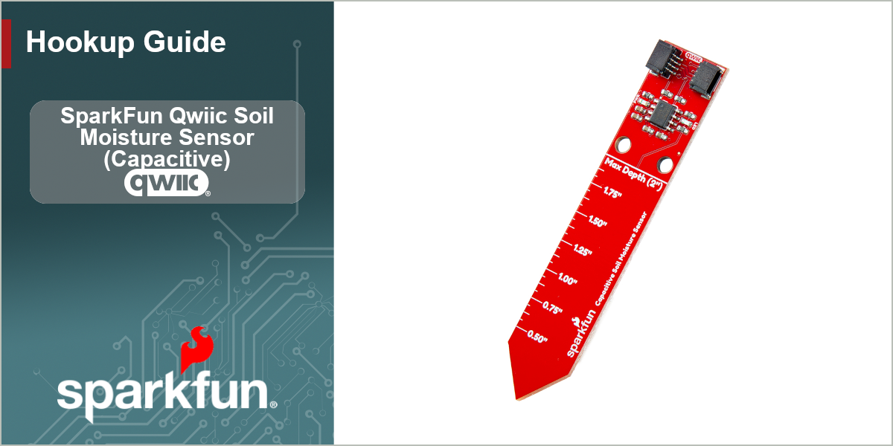

<figure markdown>
[{ width="800"}](https://www.sparkfun.com/sparkfun-qwiic-soil-moisture-sensor-capacitive.html)
</figure>

The SparkFun Qwiic Soil Moisture Sensor (Capacative) is a simple sensor breakout to measure moisture in soil and similar substances. The breakout measures moisture using a capacitive plate in the board along with the CY8CMBR3102 Capsense&reg; Express&trade; controller. Because this soil moisture sensor does not have exposed metal leads it's more resistant to corrosion. The board also includes a ruler with both Imperial and Metric units to measure the sensor's depth in soil for more precise moisture data. There's also a blue status LED tied to the CY8CMBR3102 which can be used as a visual indicator for when the sensor measures beyond a user-defined threshold value.

The SparkFun Qwiic Soil Moisture Sensor (Capacative) has code packages available for both the Arduino IDE as well as MicroPython. These code packages cover how to calibrate the sensor for different soil compositions to get reliable and usable soil moisture data from the sensor.

In this Quick Start guide we'll cover how to assemble the sensor into a Qwiic circuit and use the SparkFun CY8CMBR3 Arduino Library to get capacitance data we can use to determine soil moisture.

## Required Materials

In order to use this Qwiic breakout board, you'll need the following materials:

* [SparkFun RedBoard IoT - ESP32](https://www.sparkfun.com/sparkfun-iot-redboard-esp32-development-board.html) (or other Arduino development board)
* [Qwiic Cable](https://www.sparkfun.com/flexible-qwiic-cable-100mm.html)

## Resources and Support Documentation

You'll find the board design files (KiCad files & schematic), relevant documentation (datasheets, white papers, etc.) and other helpful links in the **Resources**. Lastly, the **Support** section includes a Troubleshooting page that includes any helpful tips specific to this board as well as information on how to receive technical support from SparkFun.