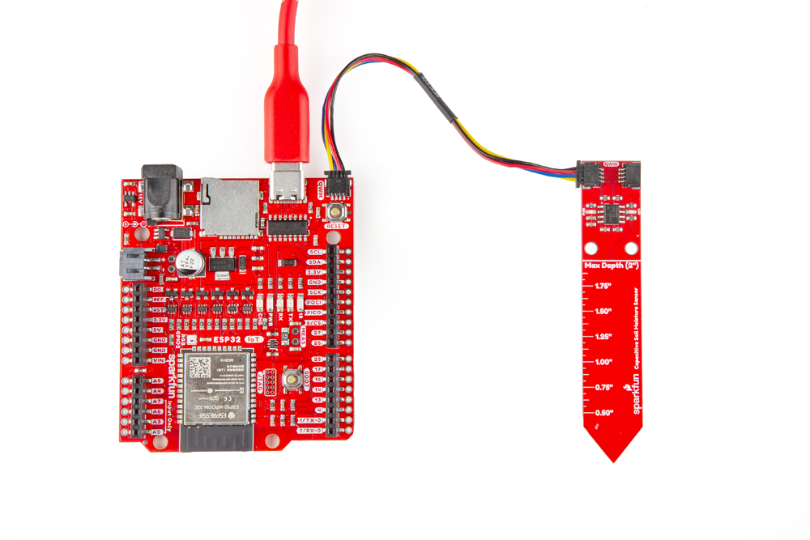

In this Quick Start guide we'll assemble the SparkFun Qwiic Soil Moisture Sensor (Capacitive) in a Qwiic circuit with the SparkFun RedBoard - IoT (ESP32) and then demonstrate how to calibrate the sensor and get soil moisture data from it using the SparkFun CY8CMBR3x Arduino Library. This guide assumes users have an understanding of the Qwiic ecosystems and how to use development boards with the Arduino IDE.

<figure markdown>
[{ width="800"}](./assets/img/Soil_Moisture_Sensor-Demo.jpg "Click to enlarge")
</figure>

## Recommended Reading

If you've never worked with microcontrollers, Arduino (or Python/MicroPython), or the Qwiic ecosystem; take a look at the following resources:

* [SparkFun IoT RedBoard - ESP32 Hookup Guide](https://learn.sparkfun.com/tutorials/iot-redboard-esp32-development-board-hookup-guide)
* [Getting Started with Arduino IDE V2](https://docs.arduino.cc/software/ide-v2/tutorials/getting-started-ide-v2/)
* [Setup and USing MicroPython for Beginners](https://learn.sparkfun.com/tutorials/setup-and-using-micropython-for-beginners)
* [Qwiic Info Page](https://www.sparkfun.com/qwiic?)

## Qwiic Assembly

* Connect the Qwiic Soil Moisture Sensor to the RedBoard IoT using a Qwiic cable.
* Connect the RedBoard IoT to your computer over USB-C.

<figure markdown>
[{ width="800"}](./assets/img/Soil_Moisture_Sensor-Qwiic_Assembly.jpg "Click to enlarge")
</figure>

## Soil Moisture Example

Now that we've connected everything up we can move on to uploading example code to get data from the sensor. We'll be demonstrating the basic example included in the Arduino Library but if you're using the MicroPython package the basic example included with it will return the same data shown here. This example initializes the sensor with default settings and prints out the capacitance (in picofarads) returned by the sensor.

* Open the [Arduino IDE](https://docs.arduino.cc/software/ide-v2/tutorials/getting-started-ide-v2/).
* Open the [Library Manager](https://docs.arduino.cc/software/ide-v2/tutorials/ide-v2-installing-a-library/) tool, search for "SparkFun CY8CMBR3" and install the latest version. This library was built using the [SparkFun Toolkit](https://github.com/sparkfun/SparkFun_Toolkit) so if you have not already installed it, search for "SparkFun Toolkit" in the Library Manager to install the dependency. 
* Open **Example01 - Basic Usage**.
* Select your Board (SparkFun RedBoard IoT - ESP32 or other board) and Port and click the "Upload" button.
* After code finishes compiling and uploading, open the [serial monitor](https://docs.arduino.cc/software/ide-v2/tutorials/ide-v2-serial-monitor/) with the baud set to **115200**.

After the code initializes you should see capacitance values (in picofarads/pf) print out every 500ms. Try touching the sensing area or insert it into the soil you'll be measuring to see the values change.

### Sensor Calibration

The Qwiic Soil Moisture Sensor (Capacitive) operates by detecting changes in capacitance in the soil it's inserted into. This works in measuring soil moisture by measuring the soil's change in [relative permittivity (or dielectric constant)](https://en.wikipedia.org/wiki/Relative_permittivity). Put simply, wet soil has a higher relative permittivity than dry soil and therefore the sensor will report higher capacitance values in wet soil. As soil dries out, it loses permittivity and the measured capacitance drops. 

Different soil types and environments can return significantly different capacitance values so it is important to calibrate the Qwiic Soil Moisture Sensor (Capacitive) to get an effective range of capacitance values for the soil it's monitoring. Start by inserting the sensor into a completely dry soil sample. Then place the sensor into a completely saturated sample of the same soil to get the max values. With this range defined, you can create thresholds to trigger events like turning on the Soil Moisture Sensor's blue STAT LED when a threshold is exceeded as demonstrated in Example 03 - LED.
